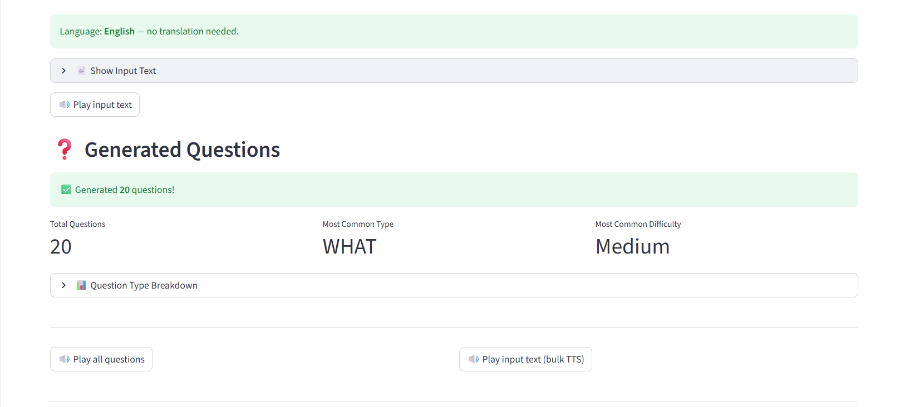
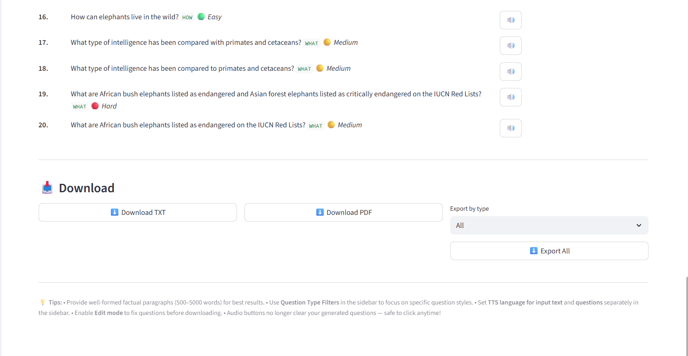

# 📚 SmartQ Generator

> An intelligent NLP-powered question generation app that transforms audio or text into structured, categorized questions — complete with Text-to-Speech playback and PDF/TXT export.


---

## 🌟 Overview

**SmartQ Generator** is a full-featured Streamlit web application that accepts audio or text input, auto-detects the language, translates to English if needed, and uses transformer-based models to generate meaningful, categorized questions. Generated questions can be filtered by type and difficulty, listened to via Text-to-Speech, edited in-browser, and downloaded as PDF or TXT files.

**Pipeline:**
```
Audio/Text → STT → Language Detection → Translation → Sentence Tokenization → Question Generation (T5) → TTS Output → Download
```

---

## ✨ Features

| Feature | Description |
|---|---|
| 🎤 **Audio Input** | Upload WAV, MP3, M4A, or OGG files; auto-transcribed via Google Speech Recognition |
| 📝 **Text Input** | Paste or type up to **5000 words** directly |
| 🌐 **Auto Translation** | Detects 50+ languages and translates to English using `deep-translator` |
| 🤖 **Transformer QG** | Three T5-based question generation models to choose from |
| 🏷️ **Question Types** | What, Why, How, Who, When, Where, Yes/No, and Definition |
| 🎯 **Difficulty Levels** | Easy, Medium, Hard, or Mixed — auto-scored by question complexity |
| 🔊 **Text-to-Speech** | Per-question and bulk TTS playback; configurable language and speed |
| ✏️ **In-Browser Editing** | Edit any generated question before downloading |
| 📄 **PDF Export** | Color-coded PDF with type groupings, difficulty badges, and source excerpt |
| 📃 **TXT Export** | Plain text export, filterable by question type |

---

## 🖥️ Demo

```
Input:  "Photosynthesis is the process by which green plants convert sunlight into food..."
Output: ✅ 20 questions generated
        🟢 What is photosynthesis?          [WHAT]  Easy
        🟡 How do plants convert sunlight?  [HOW]   Medium
        🔴 Why is chlorophyll essential...  [WHY]   Hard
        ...
```

---

## 🗂️ Project Structure

```
smartq-generator/
├── streamlit_nlp_qg_app.py   # Main application file
├── requirements.txt           # Python dependencies
├── README.md                  # This file
└── assets/                    # (optional) Screenshots, demo GIFs
```

---

## ⚙️ Installation

### Prerequisites

- Python **3.8 or higher**
- `ffmpeg` installed on your system (required for audio conversion)

**Install ffmpeg:**
```bash
# Ubuntu / Debian
sudo apt-get install ffmpeg

# macOS (Homebrew)
brew install ffmpeg

# Windows
# Download from https://ffmpeg.org/download.html and add to PATH
```

### 1. Clone the Repository

```bash
git clone https://github.com/your-username/smartq-generator.git
cd smartq-generator
```

### 2. Create a Virtual Environment (recommended)

```bash
python -m venv venv
source venv/bin/activate       # Linux/macOS
venv\Scripts\activate          # Windows
```

### 3. Install Dependencies

```bash
pip install -r requirements.txt
```

### 4. Run the App

```bash
streamlit run streamlit_nlp_qg_app.py
```

The app will open in your browser at `http://localhost:8501`.

---

## 📦 Requirements

```txt
streamlit>=1.28.0
transformers>=4.35.0
torch>=2.0.0
deep-translator>=1.11.4
SpeechRecognition>=3.10.0
pydub>=0.25.1
gTTS>=2.4.0
nltk>=3.8.1
langdetect>=1.0.9
fpdf2>=2.7.6
```

> **Note:** On first run, the selected HuggingFace model (~250MB–900MB) will be downloaded and cached automatically. Subsequent runs will load from cache.

---

## 🤖 Supported Models

| Model | Speed | Accuracy | Diversity | Best For |
|---|---|---|---|---|
| `valhalla/t5-small-qg-hl` | ⚡ Fast | Good | Low | Quick demos, low-resource environments |
| `iarfmoose/t5-base-question-generator` ⭐ | 🐢 Moderate | High | High | Best overall – diverse & natural questions |
| `allenai/t5-small-squad2-question-generation` | ⚡ Fast | Good | Medium | Reading comprehension (SQuAD-style) questions |

---

### ⚠️ Note
The model `mrm8488/t5-base-finetuned-question-generation` has been removed due to availability issues on Hugging Face and may cause runtime errors.

---

### 💡 Recommendation
For best results:
- Use **`iarfmoose/t5-base-question-generator`**
- Enable sampling (`top_k`, `top_p`) for better diversity

## 🎛️ Settings Reference

### Sidebar — General

| Setting | Description |
|---|---|
| **Model** | Choose the transformer model for question generation |
| **Max questions** | Slider: 5 to 100 total questions |
| **Allow < 500 words** | Override the minimum word-count guard |
| **TTS slow mode** | Slower, clearer speech synthesis |

### Sidebar — Question Type Filters

Select one or more types to restrict generation:
`What`, `Why`, `How`, `Who`, `When`, `Where`, `Yes/No`, `Definition`, `All Types`

### Sidebar — Difficulty

`Easy` (≤8 words) · `Medium` (9–14 words) · `Hard` (15+ words) · `Mixed`

### Sidebar — TTS Language

- **Input text TTS:** Language used when playing back the original/translated text
- **Questions TTS:** Language used when playing back generated questions (default: English)

Supported TTS languages: English, Hindi, French, German, Spanish, Kannada, Telugu, Tamil, Arabic, Portuguese, Japanese, Chinese (Simplified)

---

## 📖 Usage Guide

### Text Input
1. Select **"Paste text"** as input type
2. Paste 500–5000 words of factual, well-structured content
3. Configure sidebar settings
4. Click **🚀 Generate Questions**

### Audio Input
1. Select **"Upload audio"** as input type
2. Upload a WAV, MP3, M4A, or OGG file
3. Review the auto-transcribed text (editable)
4. Click **🚀 Generate Questions**

### Viewing & Editing Results
- Questions appear in tabs grouped by type (`All`, `WHAT`, `HOW`, etc.)
- Each question shows its **type tag** and **difficulty badge**
- Click **🔊** next to any question for per-question TTS playback
- Enable **✏️ Edit mode** to modify any question in-browser before exporting

### Exporting
| Format | Contents |
|---|---|
| **TXT** | Numbered list with type and difficulty tags |
| **PDF** | Color-coded, grouped by type, includes source excerpt |
| **Filtered TXT** | Export only questions of a chosen type |

---

## 🌐 Language Support

**Input languages (auto-detected + translated):** Arabic, Bengali, Chinese, Dutch, French, German, Greek, Gujarati, Hindi, Indonesian, Italian, Japanese, Kannada, Korean, Malayalam, Marathi, Polish, Portuguese, Punjabi, Russian, Spanish, Swahili, Tamil, Telugu, Thai, Turkish, Ukrainian, Urdu, Vietnamese, and many more.

**TTS playback languages:** English, Hindi, French, German, Spanish, Kannada, Telugu, Tamil, Arabic, Portuguese, Japanese, Chinese (Simplified)

---

## 🏗️ Architecture

```
┌──────────────────────────────────────────────────────┐
│                   Streamlit UI                        │
│  ┌────────────┐   ┌────────────┐   ┌──────────────┐  │
│  │ Text Input │   │ Audio Input│   │  Sidebar     │  │
│  └─────┬──────┘   └─────┬──────┘   │  Settings    │  │
│        │                │           └──────────────┘  │
│        ▼                ▼                              │
│  ┌──────────────────────────┐                         │
│  │   Language Detection     │  ← langdetect           │
│  │   + Translation          │  ← deep-translator      │
│  └────────────┬─────────────┘                         │
│               ▼                                       │
│  ┌──────────────────────────┐                         │
│  │  Sentence Tokenization   │  ← NLTK punkt           │
│  └────────────┬─────────────┘                         │
│               ▼                                       │
│  ┌──────────────────────────┐                         │
│  │  T5 Question Generation  │  ← HuggingFace pipeline │
│  └────────────┬─────────────┘                         │
│               ▼                                       │
│  ┌──────────────────────────┐                         │
│  │ Type Classification      │  (rule-based)           │
│  │ Difficulty Scoring       │  (word-count heuristic) │
│  └────────────┬─────────────┘                         │
│               ▼                                       │
│  ┌────────────────────────────────────────────┐       │
│  │  Output: TTS (gTTS) · PDF (fpdf2) · TXT   │       │
│  └────────────────────────────────────────────┘       │
└──────────────────────────────────────────────────────┘
```
## 📸 Application Screenshots

## 📸 Application Screenshots

<table>
  <tr>
    <td align="center">
      <b>🖥️ Main Dashboard</b><br>
      
    </td>
    <td align="center">
      <b>⚙️ Settings & Filters</b><br>
      
    </td>
  </tr>
  <tr>
    <td align="center">
      <b>❓ Generated Questions</b><br>
      
    </td>
    <td align="center">
      <b>📥 Download & Export</b><br>
      
    </td>
  </tr>
</table>

## ⚡ Performance Tips

- Use **`valhalla/t5-small-qg-hl`** for faster generation on CPU
- Keep input to **500–2000 words** for the best speed/quality balance
- If you have a CUDA-compatible GPU, set `CUDA_VISIBLE_DEVICES=0` before running
- The model is cached after the first load — subsequent runs are significantly faster

---

## 🐛 Troubleshooting

| Issue | Fix |
|---|---|
| `ffmpeg not found` | Install ffmpeg and ensure it's in your system PATH |
| `Speech recognition failed` | Check internet connection; Google STT requires network access |
| `Translation warning` | Input may be too long; app will auto-chunk and retry |
| `PDF generation failed` | Special characters (non-Latin) may need manual encoding; use TXT as fallback |
| `TTS error` | Selected TTS language may not support the text; switch to English TTS |
| Model download hangs | Check your internet connection; models are 250MB–900MB |

---

## 🤝 Contributing

Contributions are welcome!

1. Fork the repository
2. Create your feature branch: `git checkout -b feature/amazing-feature`
3. Commit your changes: `git commit -m 'Add amazing feature'`
4. Push to the branch: `git push origin feature/amazing-feature`
5. Open a Pull Request

### Ideas for Contribution
- Add MCQ (multiple choice) question generation
- Support for local Whisper-based STT (offline audio transcription)
- Add answer extraction alongside questions
- Docker deployment support
- Unit tests for question classification and difficulty scoring

---

## 📄 License

This project is licensed under the **MIT License** — see the [LICENSE](LICENSE) file for details.

---

## 🙏 Acknowledgements

- [Hugging Face Transformers](https://huggingface.co/transformers/) — T5 question generation models
- [Streamlit](https://streamlit.io/) — Web UI framework
- [gTTS](https://gtts.readthedocs.io/) — Google Text-to-Speech
- [deep-translator](https://github.com/nidhaloff/deep-translator) — Multi-engine translation
- [SpeechRecognition](https://github.com/Uberi/speech_recognition) — Audio transcription
- [NLTK](https://www.nltk.org/) — Natural language tokenization
- [fpdf2](https://pyfpdf.github.io/fpdf2/) — PDF generation

---

<p align="center">Made with ❤️ using Python & Streamlit</p>
